<p align="center">
<a href= "https://www.fiap.com.br/"></a>
</p>

<br>

# Nome do projeto: Challenge - Sprint 2 - Reply

## Nome do grupo: Rumo ao NEXT

## 👨‍🎓 Integrantes:

- Felipe Livino dos Santos (RM 563187)
- Daniel Veiga Rodrigues de Faria (RM 561410)
- Tomas Haru Sakugawa Becker (RM 564147)
- Daniel Tavares de Lima Freitas (RM 562625)
- Gabriel Konno Carrozza (RM 564468)

## 👩‍🏫 Professores:

### Tutor(a)

- Leonardo Ruiz Orabona

### Coordenador(a)

- ANDRÉ GODOI CHIOVATO

# Projeto de Monitoramento de Equipamentos Industriais com ESP32

Este projeto foi desenvolvido como parte do desafio da **Hermes Reply**, focado em soluções digitais para a Indústria 4.0. O objetivo é simular um sistema de monitoramento inteligente de equipamentos utilizando um microcontrolador ESP32 e sensores para coletar dados críticos em tempo real, como temperatura, umidade e vibração.

A simulação foi construída na plataforma **Wokwi**, permitindo a criação de um circuito virtual, a programação de sensores e a coleta de dados para análise, replicando um cenário de digitalização do chão de fábrica.

## 1. Sensores Virtuais e Justificativa

Para este projeto, foram selecionados os seguintes sensores, que são fundamentais para o monitoramento da saúde e segurança de equipamentos industriais:

- **DHT22 (Sensor de Temperatura e Umidade):** Escolhido por sua capacidade de medir duas das variáveis ambientais mais críticas em um ambiente industrial. Variações extremas de temperatura e umidade podem indicar falhas de refrigeração, superaquecimento de componentes ou condições operacionais inadequadas.
- **MPU6050 (Acelerômetro e Giroscópio):** Utilizado para medir a vibração do equipamento. A análise de vibração é uma das técnicas mais eficazes para a manutenção preditiva, permitindo detectar anomalias como desalinhamento, folgas mecânicas ou desgaste de rolamentos antes que causem uma falha catastrófica.
- **Display LCD I2C 16x2:** Integrado para fornecer feedback visual e em tempo real do status do sistema diretamente no local, exibindo informações de conexão, status operacional e alertas críticos.

## 2. Esquema do Circuito na Simulação

A imagem abaixo apresenta o esquema elétrico do circuito montado na plataforma Wokwi, demonstrando as conexões entre o ESP32, os sensores (DHT22, MPU6050) e o display LCD.

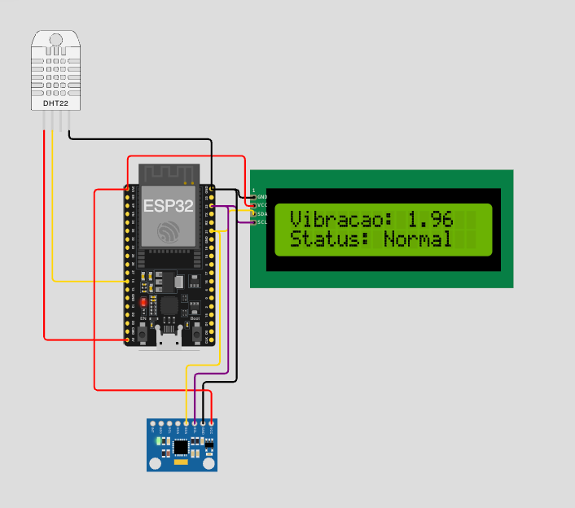


## 3. Funcionamento do Sistema e Leitura de Dados

O sistema opera em dois estágios principais: **Calibração** e **Monitoramento Contínuo**.

1.  **Inicialização e Calibração:**

    - Ao ser ligado, o sistema se conecta à rede Wi-Fi. Uma mensagem é exibida no LCD durante a conexão.
    - Em seguida, o sistema entra em modo de calibração para o sensor de vibração. Ele coleta um número definido de amostras (`AMOSTRAS_CALIBRACAO` = 30) para estabelecer uma linha de base da vibração normal do equipamento.
    - Com base nessa média, são calculados os limiares de **Alerta** (1.5x a linha de base) e **Perigo** (2.5x a linha de base).

  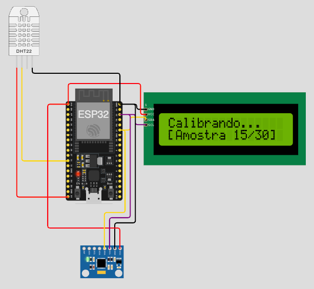
  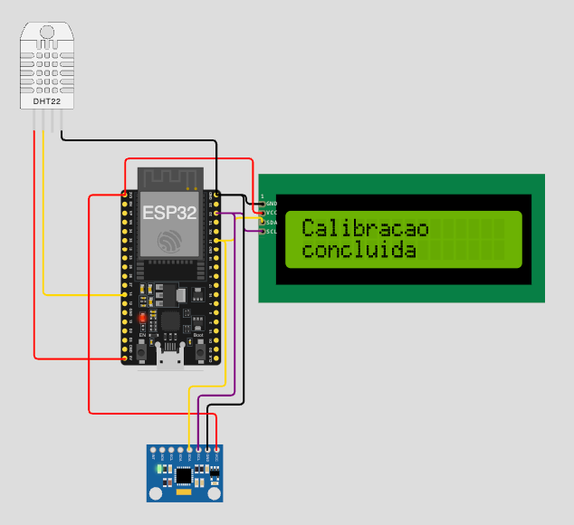

2.  **Leitura e Monitoramento:**
    - Após a calibração, o sistema entra em um loop infinito, onde lê continuamente os dados de temperatura e umidade do DHT22 e os dados de aceleração (vibração) do MPU6050.
    - Os dados lidos são exibidos no Display LCD e enviados para o Monitor Serial para registro e depuração.
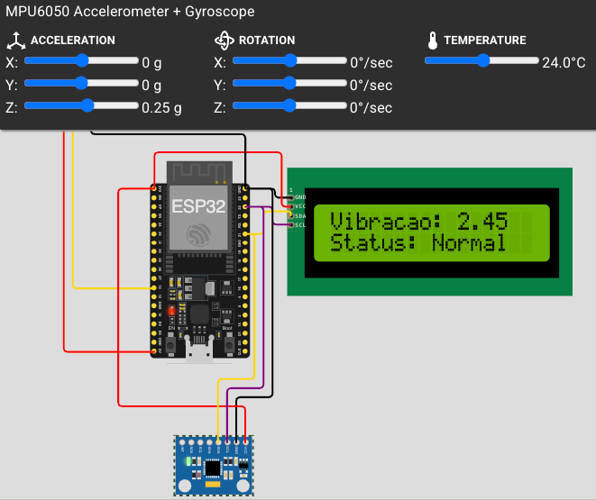

## 4. Regras de Negócio e Lógica de Alertas

O firmware implementa um conjunto de regras de negócio para classificar o estado do equipamento e emitir alertas, garantindo uma resposta rápida a possíveis anomalias.

- **Alertas Críticos de Temperatura:**

  - Se a temperatura subir acima de **40°C** ou cair abaixo de **-20°C**, o sistema exibe uma mensagem de alerta no LCD e recomenda o desligamento do equipamento.


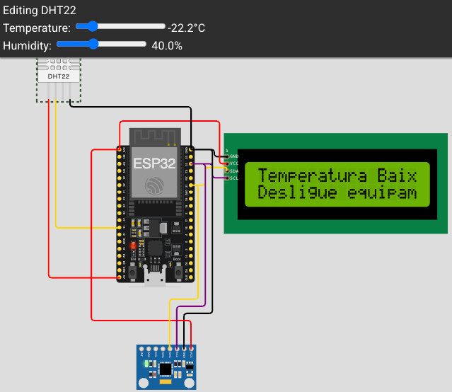


- **Alertas Críticos de Umidade:**

  - Se a umidade exceder **95%** ou ficar abaixo de **15%**, uma mensagem de alerta é mostrada, indicando condições ambientais perigosas para o equipamento.
 
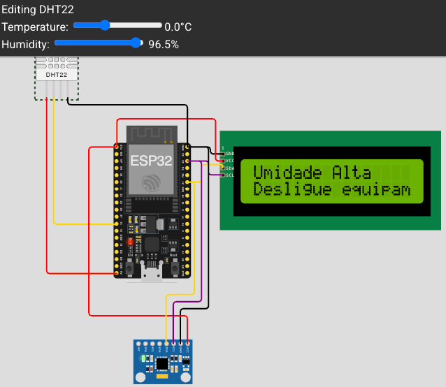
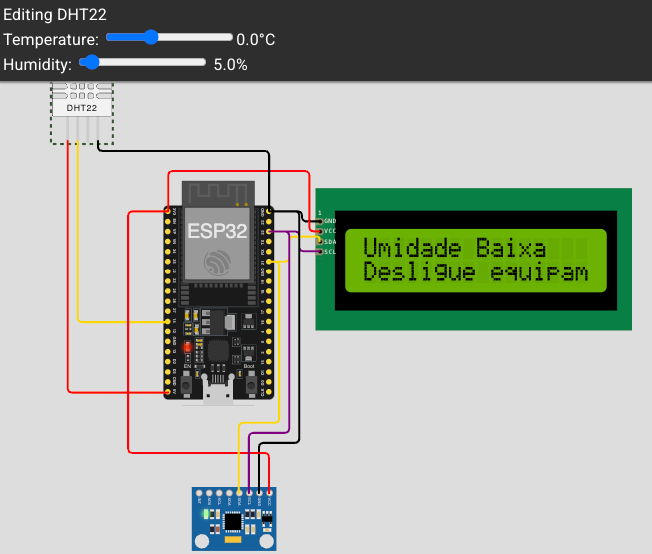

- **Níveis de Alerta de Vibração:**

  - **Normal:** A vibração está dentro da faixa esperada (abaixo do limite de alerta).
    
    

  - **Alerta:** A vibração excede o primeiro limiar (`limiteAlerta`), indicando uma anomalia que requer atenção. O status "ALERTA" é definido.

    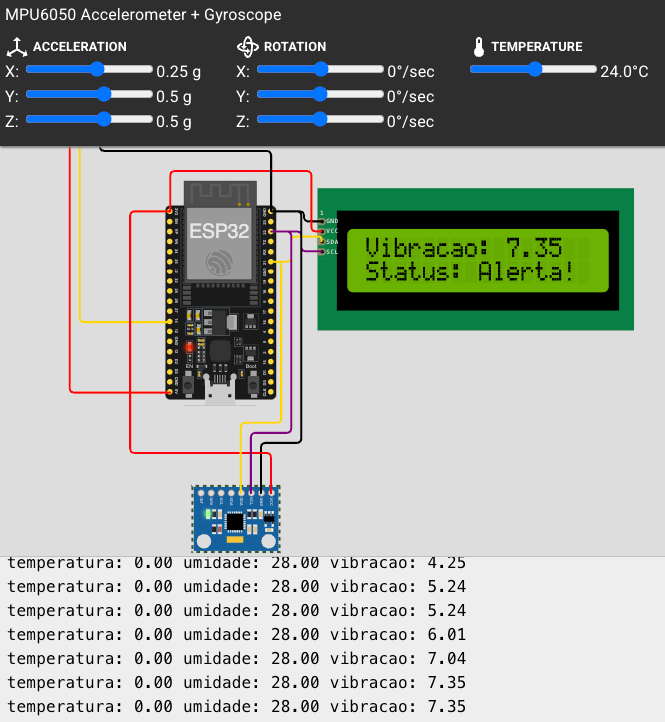

  - **Perigo:** A vibração ultrapassa o segundo limiar (`limitePerigo`), sinalizando um risco grave de falha. O status muda para "PERIGO" e o LCD exibe a mensagem **"PERIGO! DESLIGAR"**.

    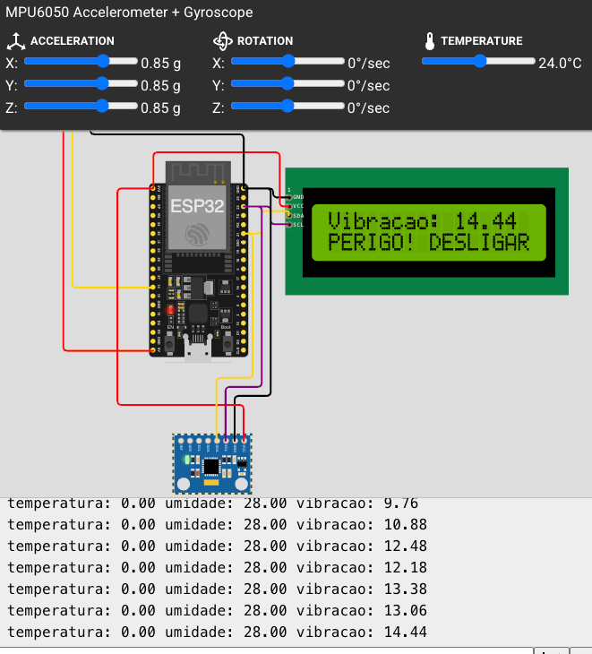

- **Envio de Dados para Web Service:**
  - O sistema foi projetado para enviar os dados coletados (status, temperatura, umidade e vibração) em formato JSON para um endpoint na nuvem. Demonstrando a capacidade de integração do projeto com plataformas de dados.

## 5. Código-Fonte Representativo

O trecho de código abaixo, da função `acelerometroFuncionamento`, ilustra a lógica central de calibração e a tomada de decisão baseada nos níveis de vibração.

```cpp
// ... parte do código da função acelerometroFuncionamento ...

float vibracaoAtual = sqrt(pow(a.acceleration.x, 2) + pow(a.acceleration.y, 2) + pow(a.acceleration.z, 2));

if (calibrando) {
  // Lógica para coletar amostras e calcular a linha de base
  baselineVibracaoMedia += vibracaoAtual;
  contadorAmostras++;

  if (contadorAmostras >= AMOSTRAS_CALIBRACAO) {
    baselineVibracaoMedia = baselineVibracaoMedia / AMOSTRAS_CALIBRACAO;
    limiteAlerta = baselineVibracaoMedia * 1.5;
    limitePerigo = baselineVibracaoMedia * 2.5;
    calibrando = false;
    // ... exibe mensagem de conclusão no LCD
  }

} else {
  // Após a calibração, monitora e classifica a vibração
  LCD.clear();
  LCD.setCursor(0, 0);
  LCD.print("Vibracao: ");
  LCD.print(vibracaoAtual);
  LCD.setCursor(0, 1);

  if (vibracaoAtual > limitePerigo) {
    status = "PERIGO";
    LCD.print("PERIGO! DESLIGAR");
  } else if (vibracaoAtual > limiteAlerta) {
    status = "ALERTA";
    LCD.print("Status: Alerta!");
  } else {
    status = "NORMAL";
    LCD.print("Status: Normal");
  }
}
```

## 6. Registro do Funcionamento (Simulação)

A operação do sistema pode ser verificada através do Display LCD e do Monitor Serial na plataforma Wokwi.

 **Monitor Serial**
O Monitor Serial exibe os dados de telemetria a cada ciclo de leitura, facilitando a coleta de dados para análise posterior.

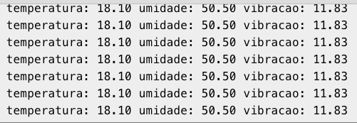


**Display LCD**

- O display LCD fornece um status visual imediato, mostrando desde a fase de calibração até os alertas de operação.


## 7. Análise de Dados e Gráficos

Os dados coletados pelo Monitor Serial podem ser salvos em um arquivo (ex: CSV) e utilizados para uma análise exploratória inicial. Com esses dados, é possível criar gráficos para visualizar o comportamento do equipamento ao longo do tempo.

Por exemplo, um gráfico de linha da vibração (rosa), umidade (laranja), verde (temperatura) x tempo pode revelar tendências, picos anômalos ou a degradação gradual do equipamento, validando a eficácia dos alertas definidos.

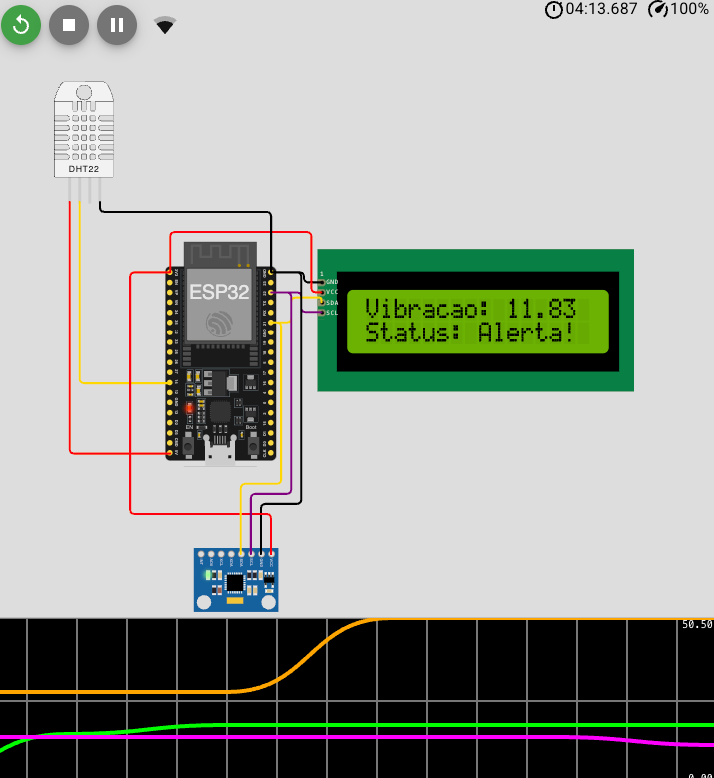

Extraindo os dados e executando o script em python temos o grafico de leitura ao longo do tempo, demonstrando a variação dos dados ao longo do tempo

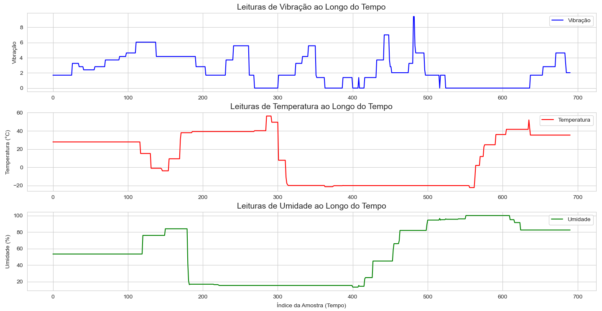

E abaixo o gráfico demonstrando o gráfico de dispersão e demonstranco a correlação entre as variaveis 

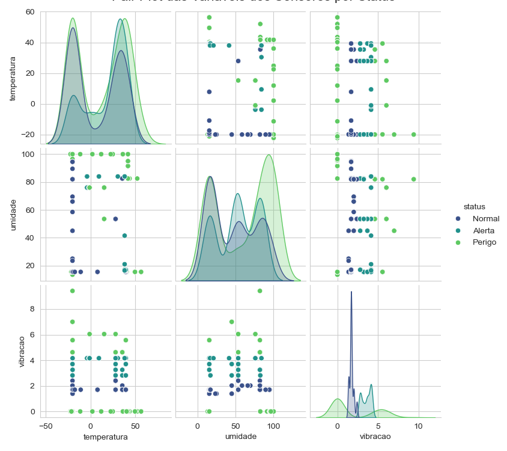


## 🗃 Histórico de lançamentos

## 📋 Licença

<p xmlns:cc="http://creativecommons.org/ns#" xmlns:dct="http://purl.org/dc/terms/"><a property="dct:title" rel="cc:attributionURL" href="https://github.com/agodoi/template">MODELO GIT FIAP</a> por <a rel="cc:attributionURL dct:creator" property="cc:attributionName" href="https://fiap.com.br">Fiap</a> está licenciado sobre <a href="http://creativecommons.org/licenses/by/4.0/?ref=chooser-v1" target="_blank" rel="license noopener noreferrer" style="display:inline-block;">Attribution 4.0 International</a>.</p>
